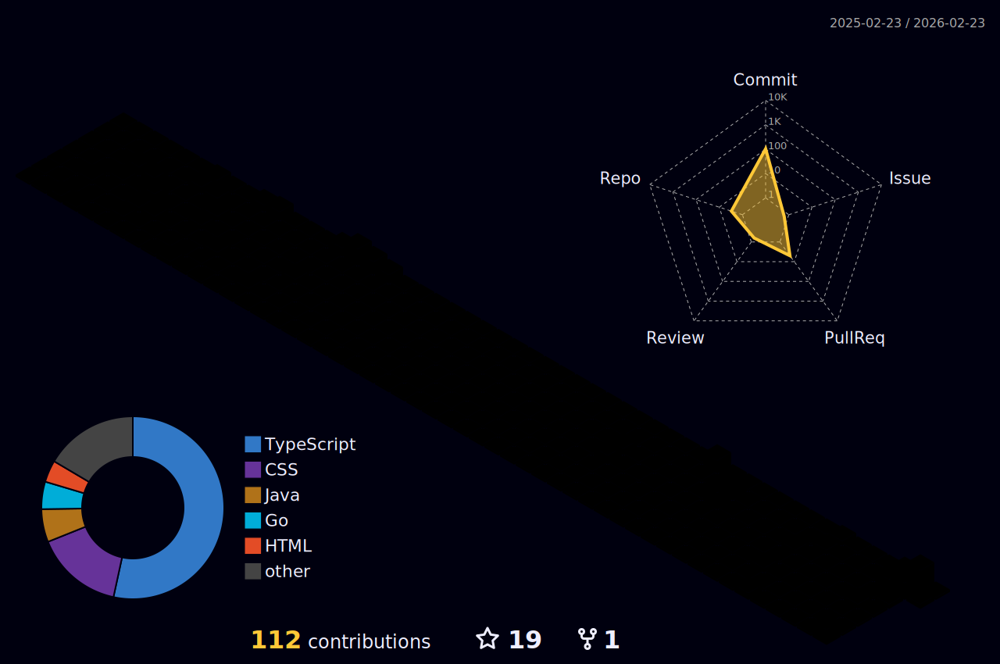

<h1 align="center">Hi 👋, I'm Bui Anh Tai</h1>
<h3 align="center">A Software Engineer from HCM</h3>

- 🔭 I graduated at **HCM City University Technology and Education**

- 📫 How to reach me **buianhtai2017tq@gmail.com**

<h3 align="left">Contact with me: </h3>
<a href="https://www.facebook.com/profile.php?id=100012248492430" target="_blank">  </a>


<h3 align="left">Programming Languages: </h3>
<div style="display: flex;">
  
  
  
  
  
  
</div>

<h3 align="left">Frameworks: </h3>
<div style="display: flex;">
  
  
  
  
  
  
 </div>

<h3 align="left">Database: </h3>
<div style="display: flex;">
  
  
  
  
 </div>

<h3 align="left">Others: </h3>
<div style="display: flex;">
  
  
  
  
  
  
</div>

## GITHUB STATS 📈
<p style="width: 100%; display: flex; justify-content: space-around; align-items: center; flex-direction: row;">


</p>

## GITHUB PROGRAM LANGUAGES



## GITHUB PROFILE TROPHY 🏆
<p>
      
</p>

## CODING ACTIVITY
<!-- <p>
  
</p> -->
<!--START_SECTION:waka-->

```txt
From: 02 February 2026 - To: 09 February 2026

Total Time: 0 secs

No activity tracked
```

<!--END_SECTION:waka-->

###

<picture>
  <source media="(prefers-color-scheme: dark)" srcset="https://raw.githubusercontent.com/buianhtai1205/buianhtai1205/output/pacman-contribution-graph-dark.svg">
  <source media="(prefers-color-scheme: light)" srcset="https://raw.githubusercontent.com/buianhtai1205/buianhtai1205/output/pacman-contribution-graph.svg">
  
</picture>

